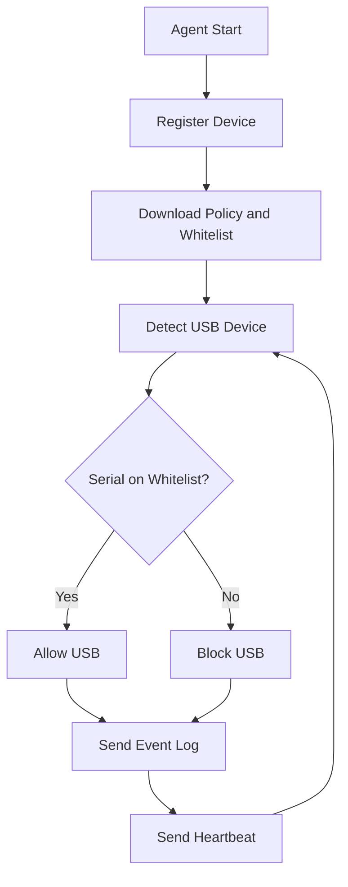

# Agent

## Purpose

Agent Windows odpowiada za egzekwowanie polityki USB na komputerze klienta oraz
komunikacje z backendem.

## Planned Responsibilities

- rejestracja urzadzenia w systemie
- wysylanie heartbeat
- pobieranie polityki USB
- wykrywanie podlaczenia urzadzen USB
- sprawdzanie whitelisty
- blokowanie lub dopuszczanie urzadzenia
- wysylanie logow zdarzen

## Agent Workflow Diagram

## Planned Runtime Model

Agent docelowo powinien dzialac jako Windows Service.

## Planned Technical Areas

- identyfikacja hosta
- komunikacja HTTP z backendem
- lokalny cache polityki
- odczyt informacji o urzadzeniach USB
- egzekwowanie polityki systemowej

## Notes

Implementacja mechanizmu blokowania USB wymaga ostroznego podejscia i dobrej
dokumentacji technicznej, zeby rozdzielic logike biznesowa od operacji
systemowych.
