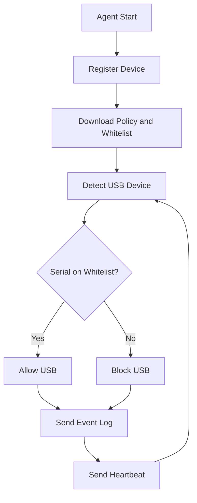

# Agent

## Purpose

Agent Windows odpowiada za egzekwowanie polityki USB na komputerze klienta oraz
komunikacje z backendem.

## Planned Responsibilities

- rejestracja urzadzenia w systemie
- wysylanie heartbeat
- pobieranie polityki USB
- wykrywanie podlaczenia urzadzen USB
- sprawdzanie whitelisty
- blokowanie lub dopuszczanie urzadzenia
- wysylanie logow zdarzen

## Agent Workflow Diagram



## Planned Runtime Model

Agent docelowo powinien dzialac jako Windows Service.

## Planned Technical Areas

- identyfikacja hosta
- komunikacja HTTP z backendem
- lokalny cache polityki
- odczyt informacji o urzadzeniach USB
- egzekwowanie polityki systemowej

## Device Fingerprint

`deviceFingerprint` to stabilny identyfikator komputera wyliczany lokalnie przez
agenta. Nie jest to sekret ani token autoryzacyjny. Jego celem jest rozpoznanie,
ze heartbeat pochodzi z tej samej maszyny nawet wtedy, gdy zmieni sie IP albo
hostname.

### Purpose

Pole jest wykorzystywane do:

- wykrywania ponownej rejestracji tego samego komputera
- ograniczania duplikatow urzadzen w bazie
- lepszego dopasowania heartbeat i eventow do jednego hosta

### Input Components

Agent powinien probowac zbudowac fingerprint z kilku wzglednie stabilnych cech:

- `machineGuid` - identyfikator instalacji Windows z rejestru
- `systemUuid` - UUID systemu raportowany przez Windows / firmware
- `primaryDiskSerial` - numer seryjny glownego dysku systemowego
- `hostname` - nazwa hosta jako skladnik pomocniczy

### Input Format

Przed obliczeniem hasha agent buduje tekst w stalej kolejnosci:

```text
v1|machineGuid=<value>|systemUuid=<value>|primaryDiskSerial=<value>|hostname=<value>
```

Kazda wartosc powinna byc:

- przycieta z bialych znakow
- znormalizowana do jednego formatu liter, np. uppercase
- zastapiona przez `UNKNOWN`, jesli nie udalo sie jej odczytac

### Hash Algorithm

Po zbudowaniu tekstu wejsciowego agent liczy hash `SHA-256` i wysyla go w
postaci ciagu hex lowercase.

Przyklad:

```text
7f4a9a7f5f9d4d1b0d78e4c4d80f56c7c7bb2e8db4f9e4c4dce1a5f91f2d8a11
```

### Important Notes

- `machineGuid` identyfikuje instalacje Windows, a nie idealnie fizyczny komputer
- po reinstalacji systemu fingerprint moze sie zmienic
- po wymianie dysku lub pracy w VM czesc danych moze byc mniej stabilna
- backend powinien traktowac fingerprint jako mocny sygnal identyfikacji, ale nie jedyne zrodlo prawdy

## Notes

Implementacja mechanizmu blokowania USB wymaga ostroznego podejscia i dobrej
dokumentacji technicznej, zeby rozdzielic logike biznesowa od operacji
systemowych.

