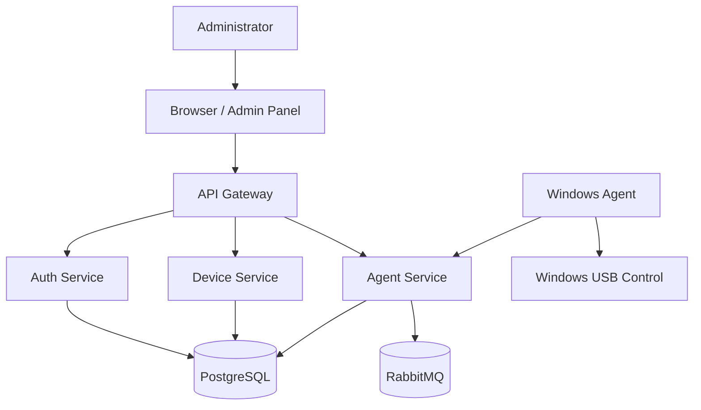
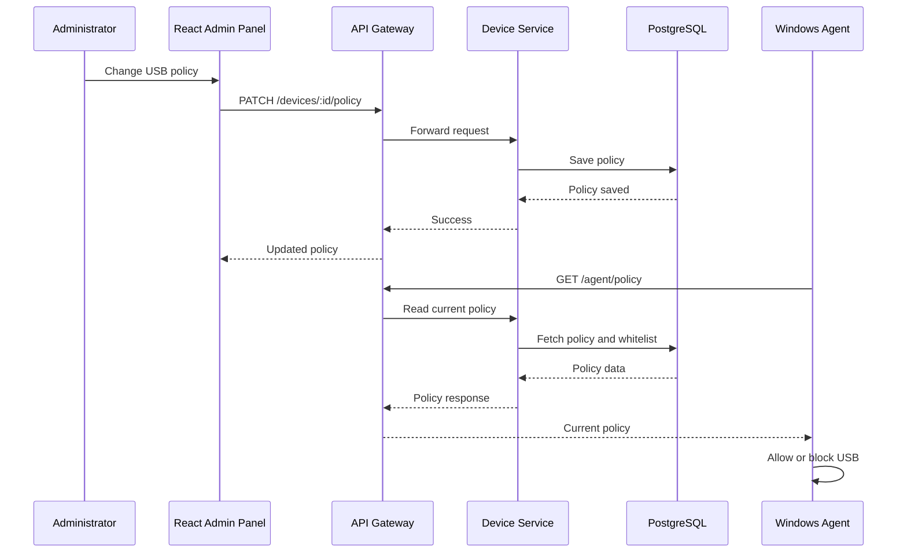

# Architecture

## Overview

USB System Control to system do centralnego zarzadzania politykami USB na
komputerach klienckich. Administrator korzysta z panelu webowego, backend
udostepnia API i przechowuje konfiguracje, a agent Windows egzekwuje polityki
na stacjach roboczych.

## Main Components

- `frontend/admin-panel` - panel administracyjny dla operatora
- `backend/api-gateway` - pojedynczy punkt wejscia dla frontendu i integracji
- `backend/auth-service` - logowanie, JWT, konta administratorow
- `backend/device-service` - urzadzenia, statusy, whitelist USB, polityki
- `backend/agent-service` - komunikacja z agentami, heartbeat, zdarzenia
- `database` - PostgreSQL jako glowna baza danych
- `rabbitmq` - komunikacja asynchroniczna i eventy
- `agent/windows-agent` - aplikacja dzialajaca na komputerach klienta

## System Diagram

## Policy Flow Diagram

## High-Level Flow

1. Administrator loguje sie do panelu.
2. Frontend komunikuje sie z API Gateway.
3. Backend zapisuje polityki i konfiguracje w PostgreSQL.
4. Agent cyklicznie pobiera polityke oraz wysyla heartbeat.
5. Agent sprawdza podlaczone USB i podejmuje decyzje lokalnie lub z pomoca API.
6. Zdarzenia trafiaja do logow systemowych.

## Initial Architecture Decision

Na start projekt ma strukture mikroserwisowa w repozytorium, ale implementacja
powinna pozostac pragmatyczna. Najwazniejsze jest stworzenie dzialajacego,
spojnego systemu, a nie maksymalna liczba uslug.
