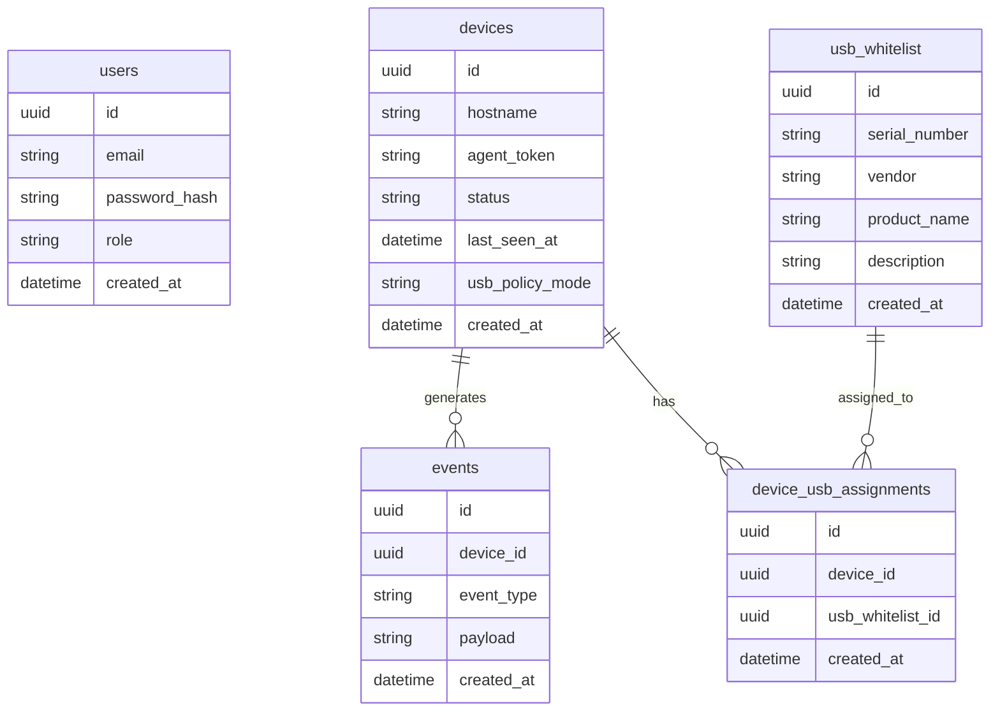

# Database

## Overview

Baza danych przechowuje administratorow, urzadzenia, polityki USB, whitelist
pendrive'ow oraz logi zdarzen.

## ERD Diagram

## Initial Entities

### `users`

- `id`
- `email`
- `password_hash`
- `role`
- `created_at`

### `devices`

- `id`
- `hostname`
- `agent_token`
- `status`
- `last_seen_at`
- `usb_policy_mode`
- `created_at`

### `usb_whitelist`

- `id`
- `serial_number`
- `vendor`
- `product_name`
- `description`
- `created_at`

### `device_usb_assignments`

- `id`
- `device_id`
- `usb_whitelist_id`
- `created_at`

### `events`

- `id`
- `device_id`
- `event_type`
- `payload`
- `created_at`

## Notes

- PostgreSQL bedzie glowna baza danych projektu.
- Finalny schemat powinien zostac dopracowany przed implementacja migracji.
- W kolejnych iteracjach mozna dodac tabele organizacji lub tenantow.
