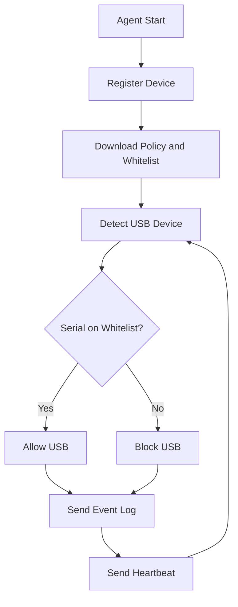

# Agent Workflow Diagram

```mermaid
flowchart TD
    Start[Agent Start]
    Register[Register Device]
    Sync[Download Policy and Whitelist]
    Detect[Detect USB Device]
    Check{Serial on Whitelist?}
    Allow[Allow USB]
    Block[Block USB]
    Heartbeat[Send Heartbeat]
    Event[Send Event Log]

    Start --> Register
    Register --> Sync
    Sync --> Detect
    Detect --> Check
    Check -->|Yes| Allow
    Check -->|No| Block
    Allow --> Event
    Block --> Event
    Event --> Heartbeat
    Heartbeat --> Detect
```
