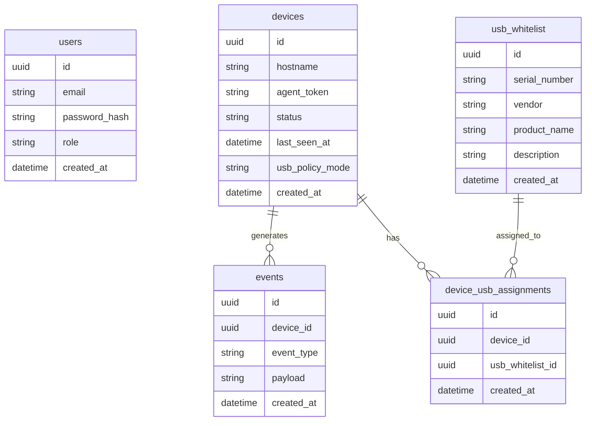

# Database ERD Diagram

```mermaid
erDiagram
    users {
        uuid id
        string email
        string password_hash
        string role
        datetime created_at
    }

    devices {
        uuid id
        string hostname
        string agent_token
        string status
        datetime last_seen_at
        string usb_policy_mode
        datetime created_at
    }

    usb_whitelist {
        uuid id
        string serial_number
        string vendor
        string product_name
        string description
        datetime created_at
    }

    device_usb_assignments {
        uuid id
        uuid device_id
        uuid usb_whitelist_id
        datetime created_at
    }

    events {
        uuid id
        uuid device_id
        string event_type
        string payload
        datetime created_at
    }

    devices ||--o{ events : generates
    devices ||--o{ device_usb_assignments : has
    usb_whitelist ||--o{ device_usb_assignments : assigned_to
```
