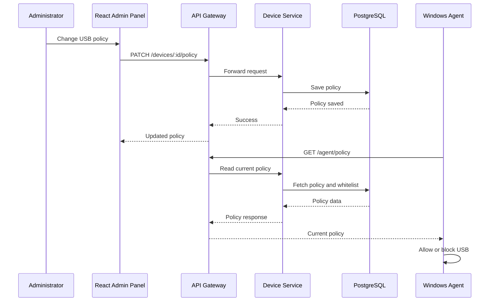

# Policy Flow Diagram

```mermaid
sequenceDiagram
    participant Admin as Administrator
    participant Frontend as React Admin Panel
    participant Gateway as API Gateway
    participant Device as Device Service
    participant DB as PostgreSQL
    participant Agent as Windows Agent

    Admin->>Frontend: Change USB policy
    Frontend->>Gateway: PATCH /devices/:id/policy
    Gateway->>Device: Forward request
    Device->>DB: Save policy
    DB-->>Device: Policy saved
    Device-->>Gateway: Success
    Gateway-->>Frontend: Updated policy
    Agent->>Gateway: GET /agent/policy
    Gateway->>Device: Read current policy
    Device->>DB: Fetch policy and whitelist
    DB-->>Device: Policy data
    Device-->>Gateway: Policy response
    Gateway-->>Agent: Current policy
    Agent->>Agent: Allow or block USB
```
