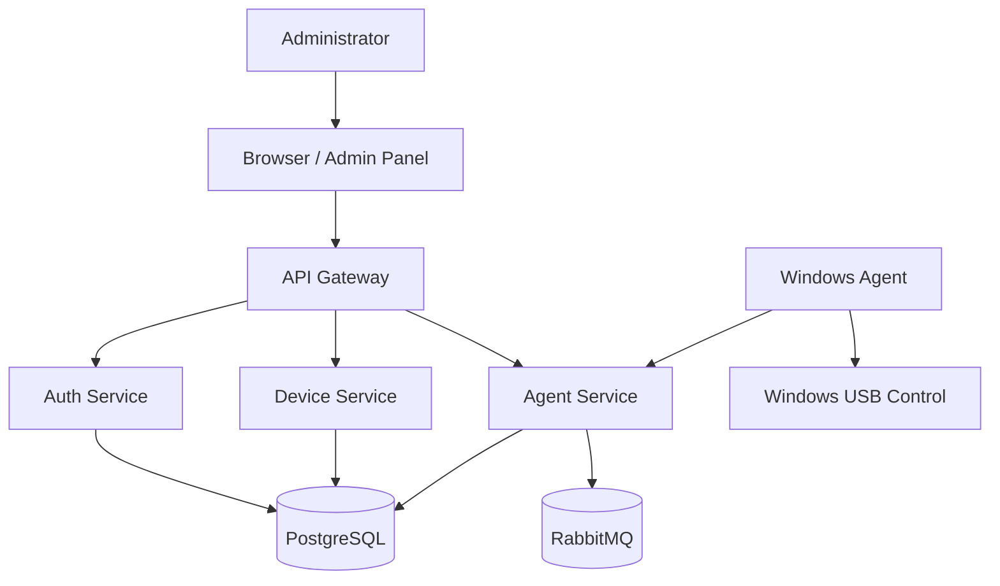

# System Architecture Diagram

```mermaid
flowchart TD
    Admin[Administrator]
    Browser[Browser / Admin Panel]
    Gateway[API Gateway]
    Auth[Auth Service]
    Device[Device Service]
    AgentService[Agent Service]
    DB[(PostgreSQL)]
    MQ[(RabbitMQ)]
    WinAgent[Windows Agent]
    OS[Windows USB Control]

    Admin --> Browser
    Browser --> Gateway
    Gateway --> Auth
    Gateway --> Device
    Gateway --> AgentService

    Auth --> DB
    Device --> DB
    AgentService --> DB
    AgentService --> MQ

    WinAgent --> AgentService
    WinAgent --> OS
```
